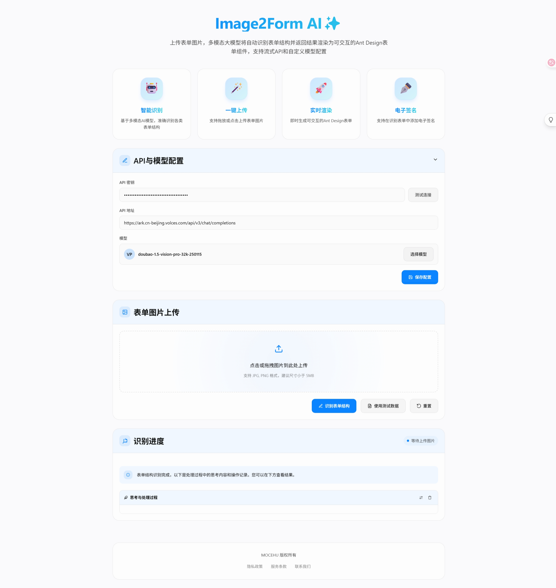
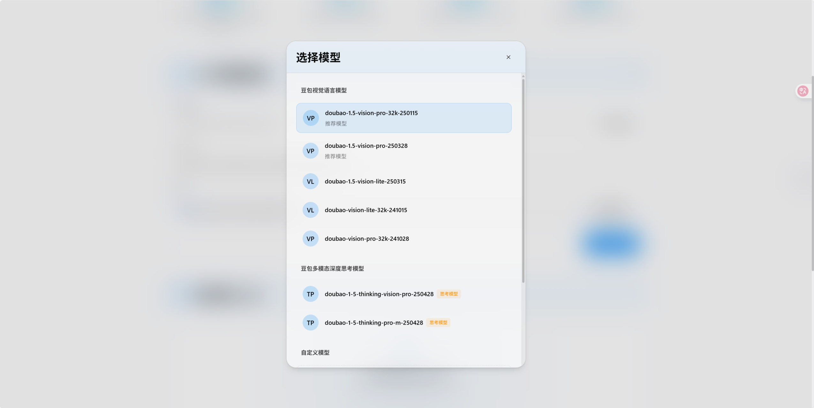
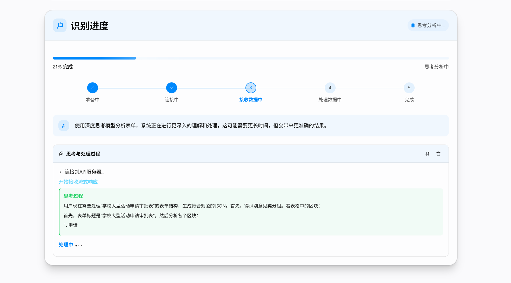
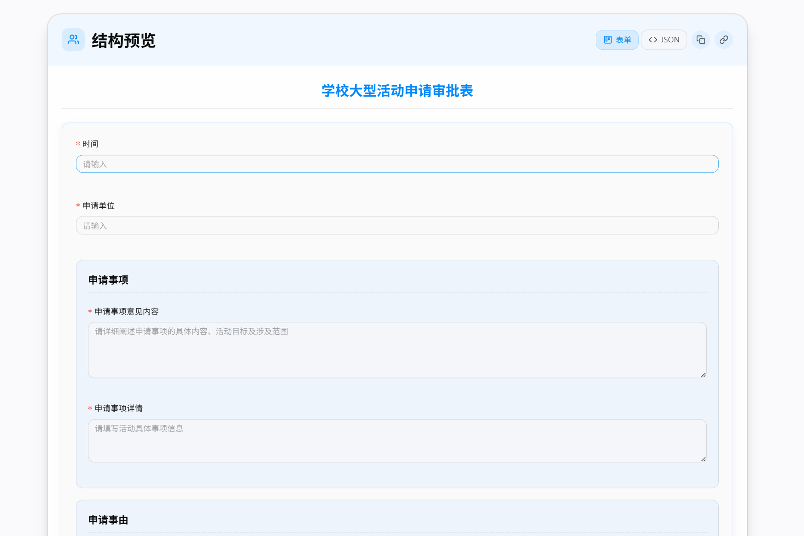
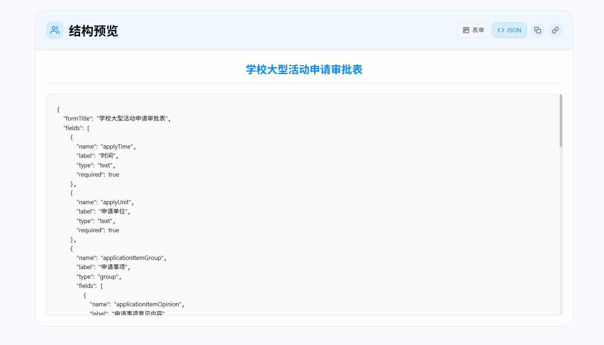
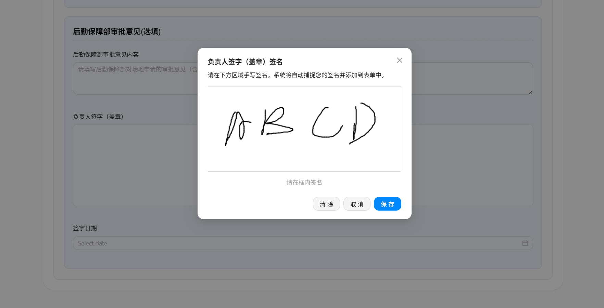
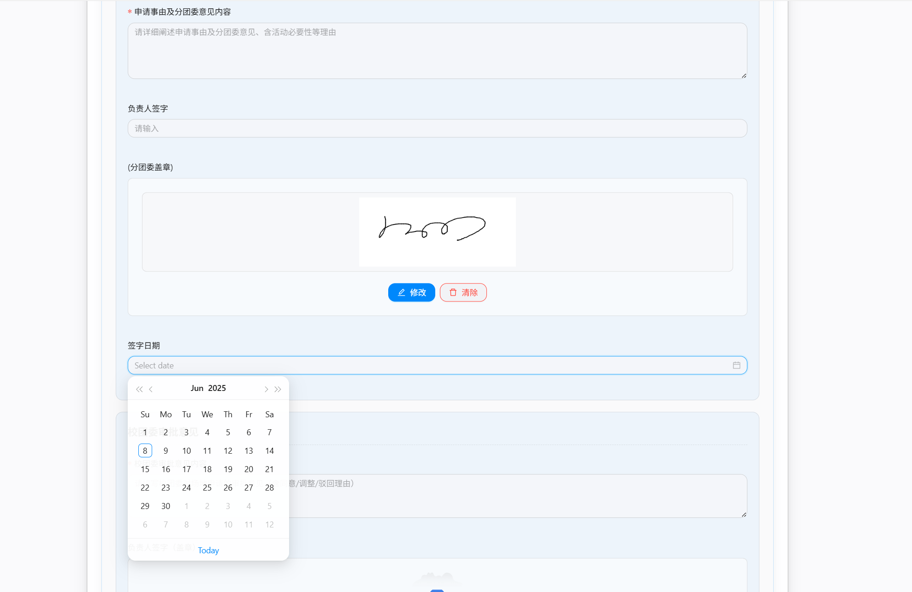
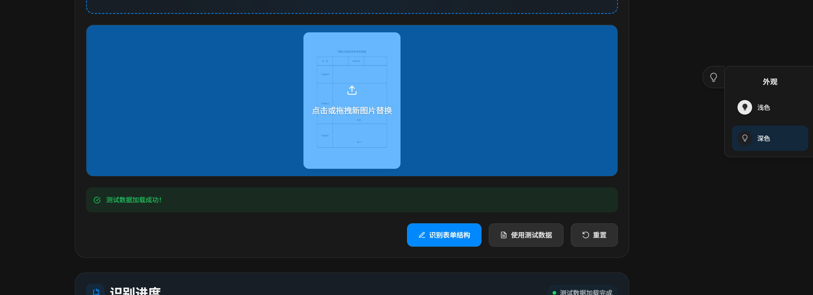

# Image2form AI✨

## 项目介绍

目前是一个纯前端的项目，通过调用多模态大模型接口将图片表单转为JSON格式，本项目采用了 Antdv 来渲染表单，同时自行封装了电子签名组件。

本项目的前端页面大部分由AI编写，若存在代码重复、设计不合理等情况请谅解。

本项目的意义在于挖掘大模型在传统领域的应用，例如低代码平台的自动识别表单，希望给更多的开发者在大模型应用开发方面提供更多思路

项目已实现功能：

- 大模型接口自定义
- 深度思考模型的适配（目前只测试了豆包系列，其他模型未测试）
- 使用 antdv 渲染表单并自定义了电子签名组件
- 良好视觉效果以及丰富的数据展示
- 久经考验的提示词，保证输出内容可用性

## 项目初始化&启动

```sh
npm install
npm run dev
```

## 项目预览图
















